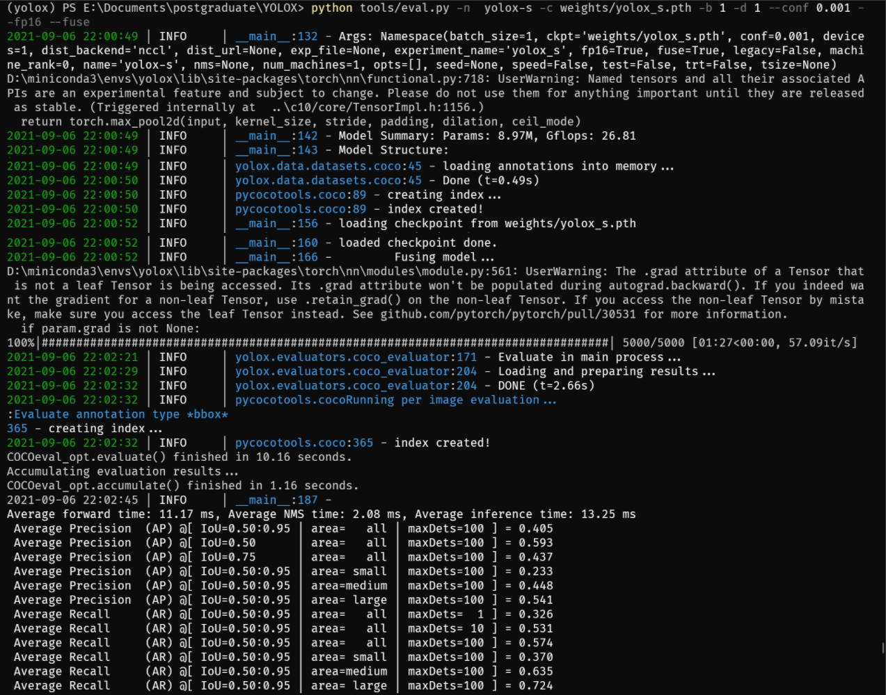
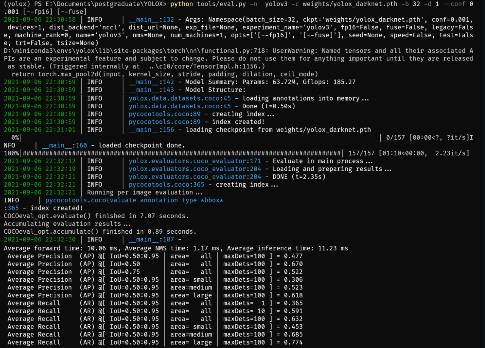
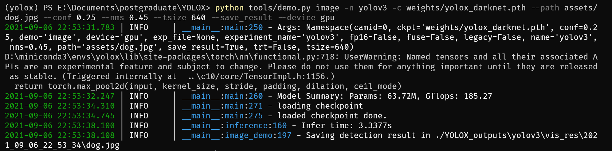
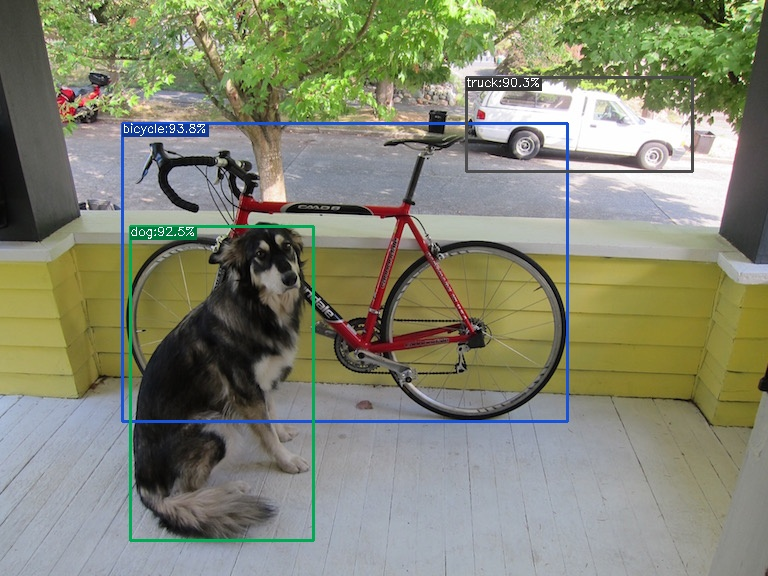
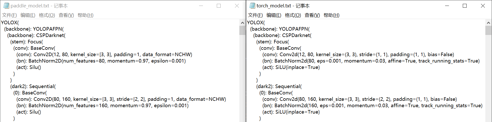
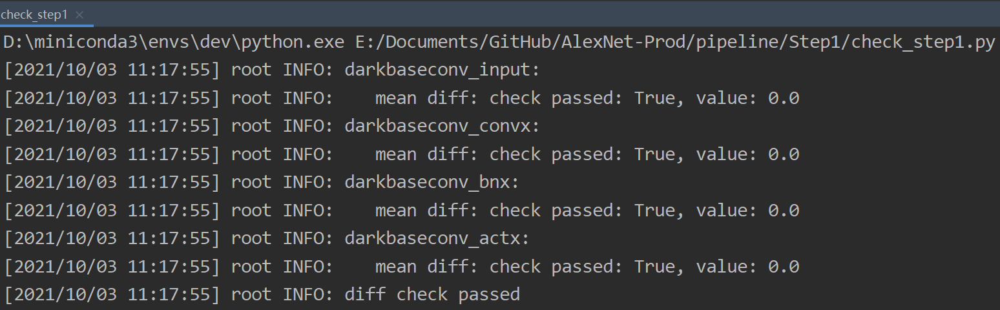
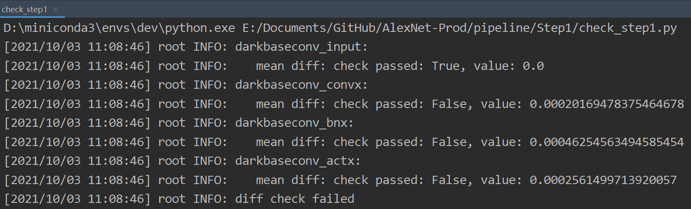

学习 YOLOX: Exceeding YOLO Series in 2021 论文，跑通原文demo代码及验证代码，并尝试使用飞桨框架复现。
# 复现赛流程


# 原论文代码实现

## 评估

* YOLOX-s 模型评估

```shell
python tools/eval.py -n  yolox-s -c weights/yolox_s.pth -b 1 -d 1 --conf 0.001 --fp16 --fuse
```



* YOLOX-Darknet53 模型评估

```shell
python tools/eval.py -n  yolov3 -c weights/yolox_darknet.pth -b 32 -d 1 --conf 0.001 [--fp16] [--fuse]
```



* 原论文结果

| Model | size | mAP<sup>val<br>0.5:0.95 | mAP<sub>test<br>0.5:0.95 | Speed V100<br>(ms) | Params<br>(M) | FLOPs<br>(G) | weights |
| ------        |:---: | :---:    | :---:       |:---:     |:---:  | :---: | :----: |
|[YOLOX-s](./exps/default/yolox_s.py)    |640  |40.5 |40.5      |9.8      |9.0 | 26.8 | [github](https://github.com/Megvii-BaseDetection/YOLOX/releases/download/0.1.1rc0/yolox_s.pth) |
|[YOLOX-m](./exps/default/yolox_m.py)    |640  |46.9 |47.2      |12.3     |25.3 |73.8| [github](https://github.com/Megvii-BaseDetection/YOLOX/releases/download/0.1.1rc0/yolox_m.pth) |
|[YOLOX-l](./exps/default/yolox_l.py)    |640  |49.7 |50.1      |14.5     |54.2| 155.6 | [github](https://github.com/Megvii-BaseDetection/YOLOX/releases/download/0.1.1rc0/yolox_l.pth) |
|[YOLOX-x](./exps/default/yolox_x.py)   |640   |51.1 |**51.5**  | 17.3    |99.1 |281.9 | [github](https://github.com/Megvii-BaseDetection/YOLOX/releases/download/0.1.1rc0/yolox_x.pth) |
|[YOLOX-Darknet53](./exps/default/yolov3.py)   |640  | 47.7 | 48.0 | 11.1 |63.7 | 185.3 | [github](https://github.com/Megvii-BaseDetection/YOLOX/releases/download/0.1.1rc0/yolox_darknet.pth) |

***对比发现模型成功跑通，AP 值符合原论文结果。***

## 预测

```shell
python tools/demo.py image -n yolov3 -c weights/yolox_darknet.pth --path assets/dog.jpg --conf 0.25 --nms 0.45 --tsize 640 --save_result --device gpu
```



* 预测结果



***从预测图可以看出，不同类别被正确框选出来，且预测正确，具有较高的置信度。***

# 复现结果
* 复现网络结构与原论文基本一致，结果保存在 compare 文件夹下的 paddle_model.txt 和 torch_model.txt 文件中

* 单卡训练命令可以运行，随着 iter 的迭代 loss 会下降，训练命令如下

```shell
python tools/train.py -n yolox-s -d 1 -b 8
                         yolox-m
                         yolox-l
                         yolox-x
```

* ***前向对齐存在问题，应用 reprod_log 进行前向对齐测试，过程中发现 CSPDarknet 的 stem.BaseConv 和 dark2.BaseConv 具有同样的网络结构，然而 stem.BaseConv 部分前向对齐通过，dark2.BaseConv 部分前向对齐并未通过，我目前并没有找出问题所在，所以这次的复现没有成功***



**stem.BaseConv diff**



**dark2.BaseConv diff**



# AI Studio 链接

[YOLOX_convert - 飞桨AI Studio - 人工智能学习实训社区 (baidu.com)](https://aistudio.baidu.com/aistudio/projectdetail/2385233)

# Reference

* **原作者代码**

  [Megvii-BaseDetection/YOLOX: YOLOX is a high-performance anchor-free YOLO, exceeding yolov3~v5 with MegEngine, ONNX, TensorRT, ncnn, and OpenVINO supported. Documentation: https://yolox.readthedocs.io/ (github.com)](https://github.com/Megvii-BaseDetection/YOLOX)

* 参考代码

  [jesse01/paddle-yolox: yolox的paddle实现 (github.com)](https://github.com/jesse01/paddle-yolox)

  [bubbliiiing/yolox-pytorch: 这是一个yolox-pytorch的源码，可以用于训练自己的模型。 (github.com)](https://github.com/bubbliiiing/yolox-pytorch)

  [基于飞桨复现目标检测算法yolox - 飞桨AI Studio - 人工智能学习实训社区 (baidu.com)](https://aistudio.baidu.com/aistudio/projectdetail/2247890)

# 致谢

十分感谢百度飞桨提供的平台，感谢各位工作人员的耐心解答，同时也感谢互联网上的每个人提供的各种教程，下面列举一些参考链接，希望对后续论文复现的选手以及平台切换的开发者有所帮助。

* [PyTorch-PaddlePaddle API映射表-API文档-PaddlePaddle深度学习平台](https://www.paddlepaddle.org.cn/documentation/docs/zh/guides/08_api_mapping/pytorch_api_mapping_cn.html)
* [pytorch版代码修改为paddle版代码总结 (baidu.com)](http://ai.baidu.com/forum/topic/show/987987)
* [X2Paddle：手把手教你迁移代码——论文复现方法论_zbp_12138的博客-CSDN博客](https://blog.csdn.net/zbp_12138/article/details/119654652)
* [模型转换论文复现_潜沉10的博客-CSDN博客](https://blog.csdn.net/qq_32097577/category_10723518.html?spm=1001.2014.3001.5482)
* [Issues · PaddlePaddle/Paddle (github.com)](https://github.com/PaddlePaddle/Paddle/issues)
* [Issues · PaddlePaddle/X2Paddle (github.com)](https://github.com/PaddlePaddle/X2Paddle/issues)

